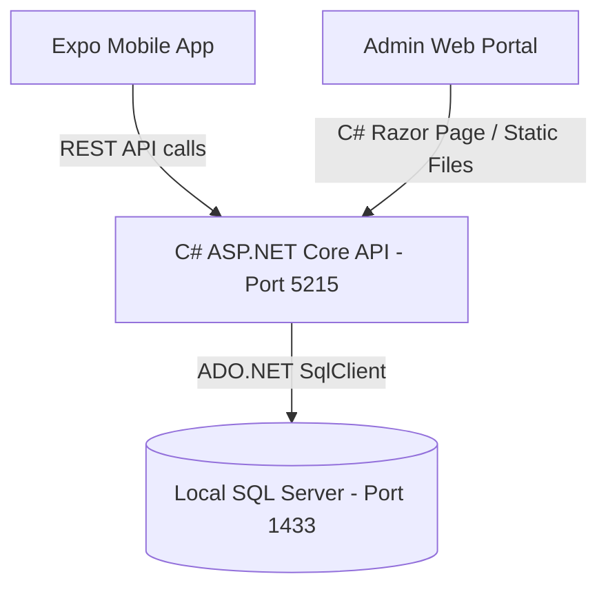

# GolfFin Project Running & Overview Guide

Welcome to the GolfFin marketplace development environment. This document outlines the project's components, architecture, and step-by-step instructions on how to start and test both the backend C# services and the Expo mobile application.

---

## 1. Project Architecture Overview

The system consists of three main parts:
1. **Database**: SQL Server 2022 running inside a Docker container.
2. **Backend Services (`GolfFinWebApi`)**: ASP.NET Core (.NET 9.0) Web API + native C# Razor Pages hosting the Admin Tools portal.
3. **Frontend Application (`GolffinApp`)**: React Native Expo mobile app using TypeScript and Expo Router.



---

## 2. Prerequisites

Ensure you have the following installed on your machine:
- [Node.js (v18+)](https://nodejs.org/)
- [Docker & Docker Compose](https://www.docker.com/)
- [.NET SDK 9.0](https://dotnet.microsoft.com/download/dotnet/9.0)
- [Expo Go](https://expo.dev/client) app installed on your physical mobile device, or Xcode/Android Studio simulators set up.

---

## 3. How to Run the Project

Follow these steps sequentially to spin up the local development environment:

### Step 1: Start the Local Database
Make sure Docker is running on your machine, then run the database container:
```bash
docker start golffindb
```
*(If the container is not created yet, you can initialize it using the script inside [scripts.txt](file:///Users/myronchan/Documents/Projects/GolfFin_Cloud/AdminList/scripts.txt).)*

### Step 2: Run the C# Backend (`GolfFinWebApi`)
1. Navigate to the Web API project directory:
   ```bash
   cd src/GolfFinWebApi
   ```
2. Build and start the backend:
   ```bash
   dotnet run --urls "http://localhost:5215"
   ```
This will:
- Establish a database connection.
- Execute automatic schema migrations (adding columns like `PasswordHash` to the `Users` table).
- Start the server on `http://localhost:5215` (serving both API controllers and the Razor Pages Admin Portal).

### Step 3: Access the Admin Tool Web Page
Open your web browser and navigate to:
- **URL**: [http://localhost:5215](http://localhost:5215)
- **Features**: Live database User Management viewer, random secure password generator, and a client-side SHA-256 hash comparison tool.

### Step 4: Run the Expo Mobile App (`GolffinApp`)
1. Navigate to the mobile app directory:
   ```bash
   cd src/UI/GolffinApp
   ```
2. Install npm dependencies (if starting for the first time):
   ```bash
   npm install
   ```
3. Start the Expo development server:
   ```bash
   npm run start
   ```
4. Press `i` to open in iOS simulator, `a` for Android, or `w` to open it in a web browser.

---

## 4. Key Endpoints Reference

| Endpoint | Method | Purpose |
| :--- | :--- | :--- |
| `/api/auth/register` | `POST` | Registers a new user with an email, display name, and password |
| `/api/auth/login` | `POST` | Authenticates email/password credentials |
| `/api/admin/users` | `GET` | Retrieves all registered database users (Admin only) |
| `/api/admin/users/reset-password` | `POST` | Updates and hashes a user's password in SQL Server |
| `/Index` (or `/`) | `GET/POST` | Renders the Admin Tools Razor Page |
