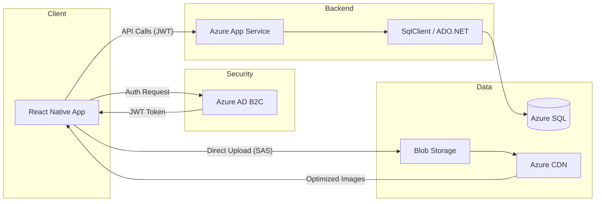

# GolfFin Architecture Design

This document details the technical architecture of the GolfFin mobile marketplace, focusing on the interaction between the React Native frontend and the Azure-based backend services.

## 1. System Components

### 1.1 Mobile Client (React Native)
- **Platform:** iOS and Android via a single TypeScript codebase.
- **State Management:** 
    - **Server State:** TanStack Query for caching and synchronizing API data.
    - **Local State:** Zustand for lightweight UI state management.
- **Networking:** Axios for REST API communication, secured by Bearer tokens.

### 1.2 Identity Layer (Azure AD B2C)
- Handles user registration, social logins (Google/Apple), and secure authentication flows.
- Issues JWT (JSON Web Tokens) that the mobile app attaches to the `Authorization` header of API requests.

### 1.3 Application Layer (Azure App Service)
- **Runtime:** ASP.NET Core (.NET 9) Web API.
- **Responsibility:** Business logic, validation, identity integration, database querying via Stored Procedures, and API exposure.
- **Database Connector:** `Microsoft.Data.SqlClient` (ADO.NET), executing performance-optimized stored procedures.

### 1.4 Persistence & Storage Layer
- **Azure SQL Database:** Relational data storage for users, payment methods, listings, and transactions.
- **Azure Blob Storage:** Stores high-resolution product images.
- **Azure CDN:** Caches images at edge locations to ensure low-latency viewing for users globally.

## 2. Detailed Data Flow

### 2.1 Authentication Flow
1. User initiates login via the React Native app.
2. App redirects to **Azure AD B2C** hosted UI.
3. Upon success, B2C returns an `access_token` to the app.
4. The app sends the token to the **GolfFin API** for all protected requests.
5. The API validates the token signature against B2C public keys.

### 2.2 Product Listing Flow (Selling)
1. Seller selects images using the device gallery.
2. App requests a **Shared Access Signature (SAS)** token from the API.
3. App uploads images directly to **Azure Blob Storage** using the SAS token (offloading heavy data from the API).
4. App sends product metadata (title, price, image URLs) to the API.
5. API saves the record in **Azure SQL**.

### 2.3 Discovery Flow (Buying)
1. Buyer opens the app; the app requests listings from the API.
2. API queries **Azure SQL** by executing stored procedures.
3. API returns listing data including **Azure CDN** URLs for the images.
4. React Native app renders images efficiently using `expo-image`.

### 2.4 My Account Flow
1. React Native app requests user profile, including phone and shipping address.
2. User can view their saved payment methods which are fetched from the `PaymentMethods` table.
3. User can view their `OrderHistory` (purchases and sales) which joins the `Orders` and `Listings` tables to retrieve transaction details.

## 3. Architecture Diagram



## 4. Scalability and Reliability

- **Database:** Azure SQL is configured with auto-scaling (Serverless tier) to handle traffic spikes during peak golf seasons.
- **Availability:** Azure App Service is deployed in a Regional pair to ensure high availability.
- **Performance:** Azure CDN reduces the load on the storage account and speeds up content delivery to the mobile client.

## 5. Security Posture

| Security Layer | Implementation |
| :--- | :--- |
| **At Rest** | Transparent Data Encryption (TDE) for Azure SQL; Encryption at rest for Blob Storage. |
| **In Transit** | Mandatory TLS 1.2+ for all API and Storage endpoints. |
| **Secrets** | Azure Key Vault for managing database strings and service principals. |
| **Network** | IP Whitelisting on Azure SQL to only allow traffic from the App Service. |
```

<!--
[PROMPT_SUGGESTION]Can you generate the Prisma schema for the database tables described in the architecture? [/PROMPT_SUGGESTION]
[PROMPT_SUGGESTION]Show me how to implement the direct-to-blob upload logic using SAS tokens in React Native.[/PROMPT_SUGGESTION]
