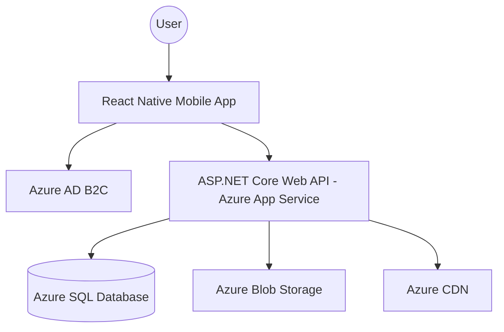

# GolfFin - Getting Started Guide

## 1. Project Overview
GolfFin is a cross-platform mobile marketplace for buying and selling golf equipment. This document outlines the architecture and steps required to initialize the project using React Native and Microsoft Azure.

## 2. Architecture Design
The application uses a cloud-native approach for scalability and security.

### High-Level Diagram


## 3. Technology Stack
| Component | Technology |
| :--- | :--- |
| **Frontend** | React Native (TypeScript / Expo) |
| **Backend** | ASP.NET Core (.NET 9) Web API with `Microsoft.Data.SqlClient` |
| **Database** | Azure SQL Database (via Stored Procedures) |
| **Authentication** | Azure Active Directory B2C |
| **Storage** | Azure Blob Storage (Images) |
| **Infrastructure** | Azure App Service, Azure CDN |

## 4. Database Schema (Azure SQL)
The following relational structure is designed for consistency and performance:

```sql
CREATE TABLE Users (
    Id UNIQUEIDENTIFIER PRIMARY KEY DEFAULT NEWID(),
    B2C_ObjectId NVARCHAR(100) UNIQUE NOT NULL,
    Email NVARCHAR(255) NOT NULL,
    DisplayName NVARCHAR(100),
    CreatedAt DATETIMEOFFSET DEFAULT SYSDATETIMEOFFSET()
);

CREATE TABLE Categories (
    Id INT PRIMARY KEY IDENTITY(1,1),
    Name NVARCHAR(50) NOT NULL
);

CREATE TABLE Listings (
    Id UNIQUEIDENTIFIER PRIMARY KEY DEFAULT NEWID(),
    SellerId UNIQUEIDENTIFIER REFERENCES Users(Id),
    CategoryId INT REFERENCES Categories(Id),
    Title NVARCHAR(200) NOT NULL,
    Price DECIMAL(18, 2) NOT NULL,
    Description NVARCHAR(MAX),
    IsSold BIT DEFAULT 0,
    CreatedAt DATETIMEOFFSET DEFAULT SYSDATETIMEOFFSET()
);

CREATE TABLE ListingImages (
    Id INT PRIMARY KEY IDENTITY(1,1),
    ListingId UNIQUEIDENTIFIER REFERENCES Listings(Id),
    ImageUrl NVARCHAR(2048) NOT NULL
);
```

## 5. Prerequisites
Before starting, ensure you have the following installed:
- [Node.js (v18+)](https://nodejs.org/)
- [React Native CLI](https://reactnative.dev/docs/environment-setup)
- [Azure CLI](https://learn.microsoft.com/en-us/cli/azure/install-azure-cli)
- [Docker](https://www.docker.com/) (Optional, for local DB testing)

## 6. Step-by-Step Setup

### Step 1: Azure Infrastructure Setup
1. **Create a Resource Group:**
   ```bash
   az group create --name GolfFin-RG --location eastus
   ```
2. **Provision Azure SQL:** Create a server and database. Enable "Allow Azure services to access server".
3. **Azure AD B2C:** Create a tenant and register your mobile app and API. Define "Sign-up and Sign-in" user flows.
4. **Blob Storage:** Create a storage account and a container named `product-images` with "Blob" public access level.

### Step 2: Backend API Initialization
1. Initialize the project:
   ```bash
   dotnet new webapi -o GolfFinWebApi
   cd GolfFinWebApi
   dotnet add package Microsoft.Data.SqlClient
   ```
2. Configure your `appsettings.json` with the connection string in the `ConnectionStrings:DefaultConnection` section.
3. Deploy stored procedures located in `SQL/database-schema.sql` and `src/GolfFinWebApi/sample-stored-procs.sql` to your Azure SQL database.

### Step 3: Frontend Mobile App Initialization
1. Create the React Native project:
   ```bash
   npx react-native@latest init GolfFin --template react-native-template-typescript
   ```
2. Install essential libraries:
   ```bash
   npm install @react-navigation/native @tanstack/react-query axios react-native-app-auth
   ```

## 7. Security Best Practices
- **Environment Variables:** Never commit secrets. Use `.env` files locally and Azure App Service Configuration in production.
- **SAS Tokens:** Use Shared Access Signatures for secure image uploads to Blob Storage.
- **JWT Validation:** Ensure the backend validates the token provided by Azure AD B2C for every request.

## 8. Development Roadmap
1. **Sprint 1:** Identity management (Login/Register) and User Profile.
2. **Sprint 2:** Item listing flow (Image upload + Metadata).
3. **Sprint 3:** Browsing, searching, and filtering.
4. **Sprint 4:** Chat functionality and Transaction history.
```

<!--
[PROMPT_SUGGESTION]Can you generate the Prisma schema file for the database design mentioned in how-to-start.md?[PROMPT_SUGGESTION]
[PROMPT_SUGGESTION]Show me how to implement the Azure AD B2C authentication logic in a React Native component.[/PROMPT_SUGGESTION]
